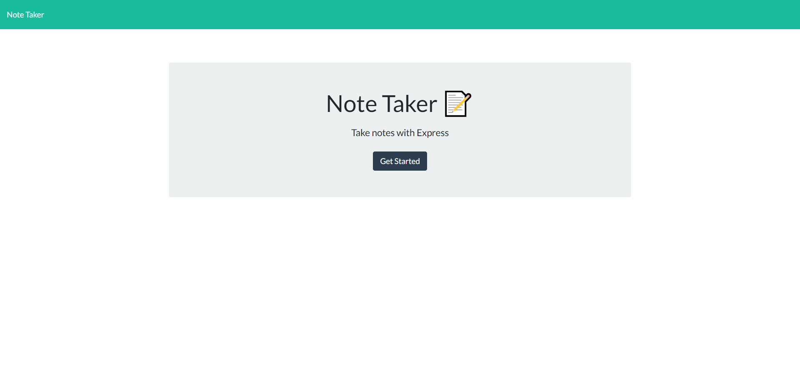

# 11 Express.js: Note Taker

UCSD-SD-FSF-PT-03-2021-U-C-MW

## Github repository and deployed heroku links below

[GitHub link](https://github.com/djony88/11_Note_App)

[Heroku link](https://damp-river-55680.herokuapp.com/)

Requirements:

* As a business owner I wan to be able to write and save notes and keep them organized.
* When I open Note Taker app I am prezented with main page wit link that I can click and it takes me to the note page.
* Then I am presented with a page with existing notes listed in lef hand column, plus empty fields to enter a note title and the note's text on right hand side.
* When I enter note title save button appears and when I click on save button my new note appears on the left hand side list.
* When I click on existing note it appears in the right hand column.
* When I click on the Write icon in the navigation at the top of the page I am presented with empty fields to enter a new note title and the note’s text in the right-hand column.
* When I click on delete icon it removes saved note in left hand column. 

Server.js:

* Setup dependencies.
* Setup Express app.
* Server listening setup.

Routes:

apiRoutes.js:

* Setup route for GET nad POST functions.

htmlRoutes.js:

* Setup route for GET functions.

